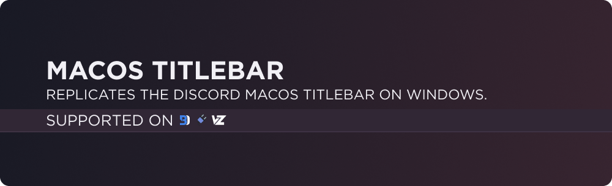

# Downloads
### **[Powercord](https://powercord.dev/) & [Vizality](https://vizality.com/)**
Head over to your **Themes folder -> open your terminal of choice -> copy-paste the following, then press enter**:
```
https://github.com/discord-extensions/macos-titlebar
```

### **[BetterDiscord](https://betterdiscord.app/)**
- [Direct Download](https://github.com/discord-extensions/macos-titlebar/releases/download/betterdiscord/macos-titlebar.theme.css)
- [Source](https://discord-extensions.github.io/macos-titlebar/src/source.css)

# Credits
[Hoofer](https://github.com/HooferDevelops) for making the window button icons.

# Support Server
If you are having any issues with the theme, feel free to join the [support server](https://discord.gg/vYdXbEzqDs), or make an issue on this repository.